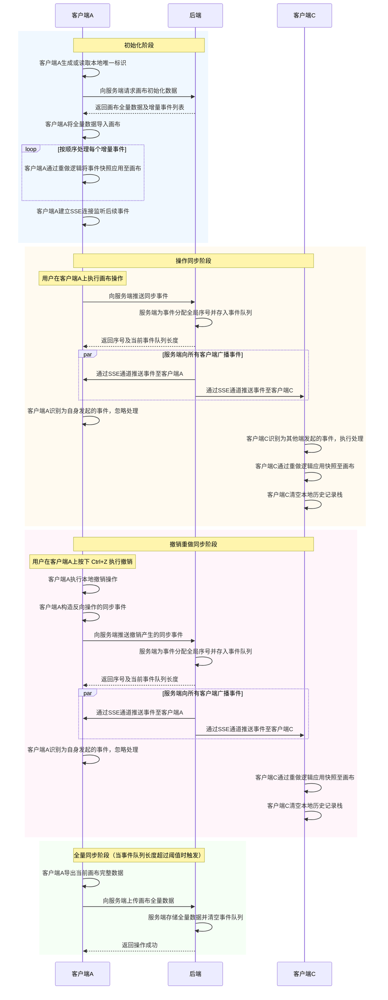

# 多端画布同步功能需求文档

## 一、功能背景

我们需要实现一个多端画布同步的功能，同一个用户在一个浏览器标签页里对画布进行操作时，他在其他标签页打开的同一个画布也能实时看到这些变化。

目前这个功能只针对图片类型的元素，包括以下操作：

**需要同步的操作类型：**

1. **添加图片**（add）：用户通过文件上传或 URL 添加新图片到画布
2. **删除图片**（remove）：用户删除画布上的图片
3. **克隆图片**（add）：用户复制已有图片，本质上是添加操作
4. **变换图片**（modify）：用户对图片进行移动、缩放、旋转等矩阵变换
5. **撤销操作**（undo）：用户按下 Ctrl+Z 撤销上一步操作，需要将撤销产生的状态变化同步到其他端
6. **重做操作**（redo）：用户按下 Ctrl+Y 或 Ctrl+Shift+Z 重做操作，需要将重做产生的状态变化同步到其他端

## 二、整体设计思路

### 2.1 基于现有历史记录机制扩展

我们现有的代码里已经有一套历史记录机制。每当用户对图片进行操作时，系统会通过 `addRecord` 方法记录一条历史，用于支持撤销和重做功能。

多端同步的核心思路是：在这个 `addRecord` 方法里加一个字段，用来标记"这次操作是否需要同步到其他端"。如果需要同步，就调用一个 HTTP 接口，把这次操作的快照数据发送给后端。

### 2.2 后端的角色

1. 维护一个数组，用来存储前端发过来的操作事件
2. 每收到一个事件，就给它分配一个全局递增的序号
3. 把这个事件广播给当前用户的所有客户端

### 2.3 发送给后端的数据格式

前端调用接口时，发送的数据包含两个关键信息：

- **clientId**：当前客户端的唯一标识，每个浏览器标签页对应一个。这个字段必填，用于让其他客户端知道这个操作是谁发起的。
- **snapshot**：操作的快照数据，就是我们现有的 HistoryRecord 类型，可以是单条记录，也可以是多条记录组成的数组。

后端返回时会带上一个 `seq` 字段，这是服务端分配的全局序号，前端发送时不需要填这个字段。

### 2.4 核心数据类型

**同步事件 SyncEvent：**

同步事件采用分类型设计，通过 `eventType` 字段区分不同的事件来源和处理方式：

| 字段 | 类型 | 必填 | 说明 |
|------|------|------|------|
| `seq` | `number` | 否（服务端返回时有） | 全局序号，由服务端分配 |
| `eventType` | `"client:change" \| "server:add_image"` | 是 | 事件类型 |
| `data` | `ClientChangeData \| ServerAddImageData` | 是 | 事件数据，根据 eventType 不同而不同 |

**ClientChangeData（前端变更事件数据）：**

| 字段 | 类型 | 必填 | 说明 |
|------|------|------|------|
| `clientId` | `string` | 是 | 客户端唯一标识 |
| `snapshot` | `HistoryRecord \| HistoryRecord[]` | 是 | 操作快照，单条或多条 |

**ServerAddImageData（后端添加图片事件数据）：**

| 字段 | 类型 | 必填 | 说明 |
|------|------|------|------|
| `urls` | `string[]` | 是 | 图片 URL 数组 |

**示例：**

```json
// 前端变更事件
{
  "seq": 101,
  "eventType": "client:change",
  "data": {
    "clientId": "a1b2c3d4-e5f6-7g8h-9i0j-k1l2m3n4o5p6",
    "snapshot": {}
  }
}

// 后端添加图片事件
{
  "seq": 102,
  "eventType": "server:add_image",
  "data": {
    "urls": ["http://localhost:3001/uploads/xxx.png"]
  }
}
```

**事件类型说明：**

| eventType | 说明 | data 结构 |
|-----------|------|-----------|
| `client:change` | 前端客户端发起的画布变更 | `{ clientId, snapshot }` |
| `server:add_image` | 后端主动添加图片 | `{ urls: string[] }` |

**设计优势：**

1. **职责清晰**：后端只需要知道图片 URL，不需要了解前端的 HistoryRecord 结构
2. **易于扩展**：后续可以方便地添加新的事件类型，如 `server:add_text`、`server:batch_delete` 等
3. **前端统一处理**：SyncManager 通过 switch-case 分发处理，`server:add_image` 在前端封装为 HistoryRecord 后复用 `client:change` 的处理逻辑

**历史记录 HistoryRecord：**

```json
{
  "id": "record_1234567890_1",
  "type": "add",
  "pluginName": "image",
  "timestamp": 1234567890123,
  "objectIds": ["img_001", "img_002"],
  "before": [
    { "id": "img_001", "data": { "left": 100, "top": 100, "scaleX": 1 } }
  ],
  "after": [
    { "id": "img_001", "data": { "left": 200, "top": 150, "scaleX": 1.5 } }
  ],
  "needSync": true
}
```

- `id`：记录唯一 ID
- `type`：操作类型，可选值为 "add" | "remove" | "modify"
- `pluginName`：负责处理的插件名称
- `timestamp`：时间戳
- `objectIds`：操作的对象 ID 列表，支持批量
- `before`：操作前状态快照数组（删除和修改操作时有值）
- `after`：操作后状态快照数组（添加和修改操作时有值）
- `needSync`：是否需要同步到其他客户端

**画布全量数据 CanvasJSON：**

```json
{
  "version": "1.0",
  "objects": [],
  "plugins": {
    "image": [...],
    "marker": [...]
  }
}
```

- `version`：数据版本号
- `objects`：画布对象数组
- `plugins`：各插件的序列化数据

## 三、客户端接收事件的处理流程

客户端通过 SSE 连接接收后端广播的事件。收到事件后，SyncManager 根据 `eventType` 字段进行分类处理，不同类型的事件走不同的处理分支。

### 3.1 处理 client:change 事件

这是前端客户端发起的画布变更事件，处理流程分三步：

**第一步：判断是否需要处理**

比对事件中的 clientId 和本地的 clientId。如果相同，说明是自己发起的操作，直接跳过。

**第二步：应用快照**

如果 clientId 不同，说明是其他端发起的操作。此时复用现有的 redo（重做）逻辑来应用快照，保持逻辑一致性，避免维护两套代码。

**第三步：清空本地历史栈**

应用完快照后清空本地历史记录栈。因为收到远程操作后，本地历史已经"过时"，继续保留可能导致撤销重做时状态不一致。

### 3.2 处理 server:add_image 事件

这是后端主动添加图片的事件。后端只知道图片的 URL，不了解前端的 HistoryRecord 结构，因此需要前端自己完成封装。

**处理思路：**

1. 从事件数据中取出 urls 数组
2. 为每个 URL 在前端构造一个标准的 HistoryRecord（类型为 add，插件为 image）
3. 将构造好的 HistoryRecord 交给 applySnapshot 处理，复用 `client:change` 的应用逻辑
4. 清空本地历史栈

**这样设计的好处：**

- 后端职责简单，只负责传递"要添加什么图片"
- 前端负责"怎么添加到画布"，掌握完整的控制权
- 新增其他类型的服务端事件时（如 `server:add_text`），只需要在前端增加对应的封装逻辑即可

## 三点五、撤销重做操作的同步

当用户在客户端执行撤销（Ctrl+Z）或重做（Ctrl+Y / Ctrl+Shift+Z）操作时，该操作同样需要同步到其他客户端。

**核心原则：撤销重做产生的状态变化，对于其他客户端而言，与用户手动操作产生的效果是等价的。**

举例说明：假设用户在客户端A上将一张图片向右移动了 200px，随后按下 Ctrl+Z 撤销该操作，图片回到原位。此时需要向后端推送一个同步事件，该事件的快照数据应当描述"图片向左移动 200px"这一状态变化。其他客户端收到该事件后，通过 redo 逻辑应用快照，最终呈现的效果与客户端A一致。

**实现要点：**

1. 在 performUndo 方法执行完毕后，需要构造一个新的同步事件并推送到后端
2. 撤销操作对应的同步事件，其快照内容应为原始记录的"反向操作"：
   - 原记录类型为 add，撤销后应同步 remove 操作
   - 原记录类型为 remove，撤销后应同步 add 操作
   - 原记录类型为 modify，撤销后应同步 modify 操作，但 before 和 after 互换
3. 在 performRedo 方法执行完毕后，直接将原始记录作为同步事件推送即可
4. 同步事件的推送应在本地状态变更完成之后进行，确保数据一致性

## 四、全量同步机制

### 4.1 为什么需要全量同步

随着用户操作的增多，事件数组会越来越长。新客户端初始化时需要遍历所有事件，效率会越来越低。因此需要定期进行全量同步，把当前画布状态整体保存，同时清空事件数组。

### 4.2 触发时机

前端调用推送事件的接口后，后端会返回"当前事件数组的长度"。前端拿到这个长度后进行判断：如果超过了一个阈值（比如 10 或 20），就触发全量同步。

### 4.3 全量同步的流程

1. 前端调用 ImportExportPlugin 的导出功能，把当前画布的完整 JSON 数据导出来
2. 调用后端的全量同步接口，把这份 JSON 数据上传
3. 后端收到后，存储这份 JSON 数据，同时清空事件数组

## 五、初始化流程

用户进入画布页面时，需要按以下顺序完成初始化：

1. 调用后端接口，获取两样东西：画布的全量 JSON 数据，以及后端维护的事件数组
2. 先把全量 JSON 数据应用到画布上（通过 ImportExportPlugin 的 import 方法）
3. 然后遍历事件数组，逐个走 redo 逻辑应用到画布上
4. 建立 SSE 连接，监听后续的同步事件

**这个顺序非常重要，不能颠倒。** 必须先有画布的基础数据，然后再在这个基础上应用增量事件。如果顺序反了，增量事件就没有操作对象，会导致状态错乱。

## 六、后端需要提供的接口汇总

### 6.1 推送同步事件

用于前端将操作事件推送到后端。

**请求：**

```
POST /api/canvas/sync/event
```

```json
{
  "eventType": "client:change",
  "data": {
    "clientId": "string",
    "snapshot": "object"
  }
}
```

**响应：**

```json
{
  "seq": 101,
  "eventArrayLength": 15
}
```

- `seq`：服务端分配的全局序号
- `eventArrayLength`：当前事件数组的长度，前端用于判断是否触发全量同步

### 6.2 后端主动添加图片

后端调试接口，用于向画布注入图片。

**请求：**

```
POST /api/canvas/sync/inject_image
```

```json
{
  "urls": ["http://localhost:3001/uploads/xxx.png"]
}
```

**响应：**

```json
{
  "success": true,
  "seq": 102
}
```

后端收到后会构造 `server:add_image` 类型的事件并广播给所有客户端。

### 6.3 上传全量画布数据

当事件数组长度超过阈值时，前端调用此接口上传画布全量数据。

**请求：**

```
POST /api/canvas/sync/full
```

```json
{
  "clientId": "string",
  "canvasJSON": "object"
}
```

**响应：**

```json
{
  "success": true
}
```

后端收到后需要：存储 canvasJSON 数据，并清空事件数组。

### 6.4 获取画布的全量数据

用户进入画布时调用，获取全量数据和增量事件。

**请求：**

```
GET /api/canvas/sync/full_data
```

**响应：**

```json
{
  "canvasJSON": "object | null",
  "events": [
    {
      "seq": 1,
      "eventType": "client:change",
      "data": {
        "clientId": "xxx-xxx-xxx",
        "snapshot": "object"
      }
    },
    {
      "seq": 2,
      "eventType": "server:add_image",
      "data": {
        "urls": ["http://localhost:3001/uploads/xxx.png"]
      }
    }
  ]
}
```

- `canvasJSON`：画布全量数据，可能为 null（首次使用时）
- `events`：增量事件数组，按 seq 升序排列

### 6.5 SSE 连接

客户端通过 SSE 连接接收服务端广播的事件。

**请求：**

```
GET /api/canvas/sync/sse?clientId=xxx
```

**广播数据格式 - 前端变更事件：**

```json
{
  "type": "sync_event",
  "data": {
    "seq": 101,
    "eventType": "client:change",
    "data": {
      "clientId": "a1b2c3d4-e5f6-7g8h-9i0j-k1l2m3n4o5p6",
      "snapshot": "object"
    }
  }
}
```

**广播数据格式 - 后端添加图片事件：**

```json
{
  "type": "sync_event",
  "data": {
    "seq": 102,
    "eventType": "server:add_image",
    "data": {
      "urls": ["http://localhost:3001/uploads/xxx.png"]
    }
  }
}
```

### 6.6 图片上传接口

为避免图片 base64 数据过大导致同步失败，图片需要先上传到服务器，画布只保存 URL 引用。

**请求：**

```
POST /api/upload/image
Content-Type: multipart/form-data
```

**响应：**

```json
{
  "success": true,
  "url": "http://localhost:3001/uploads/xxx.png",
  "filename": "xxx.png",
  "originalName": "my-image.png",
  "size": 123456
}
```

## 七、时序图



## 七点五、系统总流程图

```mermaid
flowchart TB
    subgraph 初始化
        A1([进入页面]) --> A2[获取或生成客户端标识]
        A2 --> A3[请求全量数据和增量事件]
        A3 --> A4[导入全量数据]
        A4 --> A5[依次应用增量事件]
        A5 --> A6[建立SSE连接]
    end

    subgraph 本地操作
        B1([用户操作图片]) --> B2[生成历史记录]
        B2 --> B3{需要同步?}
        B3 -->|是| B4[推送事件到服务端]
        B4 --> B5{事件数超阈值?}
        B5 -->|是| B6[触发全量同步]
    end

    subgraph 撤销重做
        C1([撤销/重做]) --> C2[执行本地操作]
        C2 --> C3{需要同步?}
        C3 -->|是| C4[推送事件到服务端]
    end

    subgraph 接收远程事件
        D1([收到SSE事件]) --> D2{是自己发的?}
        D2 -->|否| D3[应用快照到画布]
        D3 --> D4[清空本地历史栈]
        D2 -->|是| D5([忽略])
    end

    subgraph 服务端
        E1([收到事件]) --> E2[分配序号并存储]
        E2 --> E3[广播给所有客户端]
    end
```



## 八、涉及的代码文件

- **HistoryManager.ts**：历史记录管理器，需要在 addRecord 方法里加同步逻辑，performUndo/performRedo 需要推送同步事件
- **ImageHistoryHandler.ts**：图片的历史记录处理器，负责生成快照，applyUndo/applyRedo 需要支持异步
- **ImageManager.ts**：图片数据管理器，addFromFile 需要改为先上传图片获取 URL
- **ImagePlugin.ts**：图片插件入口，暴露 applyUndo/applyRedo 方法供同步调用
- **ImportExportPlugin.ts**：导入导出插件，用于全量同步时导出画布 JSON
- **SyncManager.ts**：新增，同步管理器，负责 SSE 连接、事件推送、全量同步、初始化
- **types.ts**：类型定义文件，需要新增 SyncEvent、SSEMessage 等同步相关类型